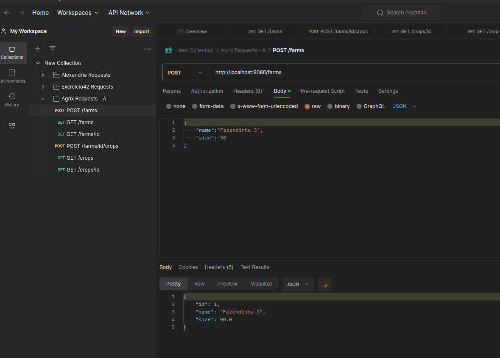
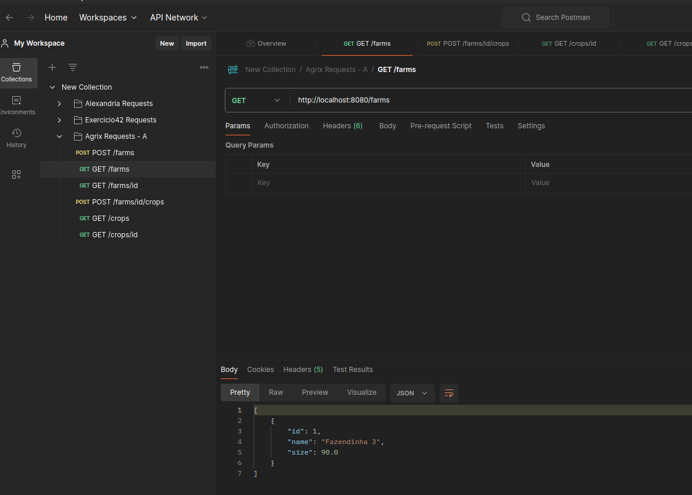
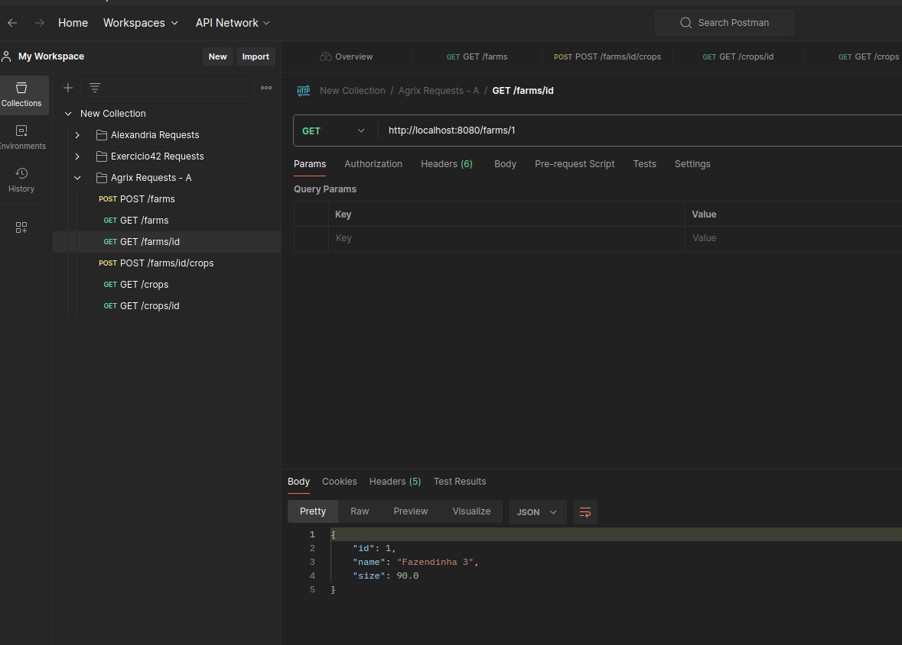
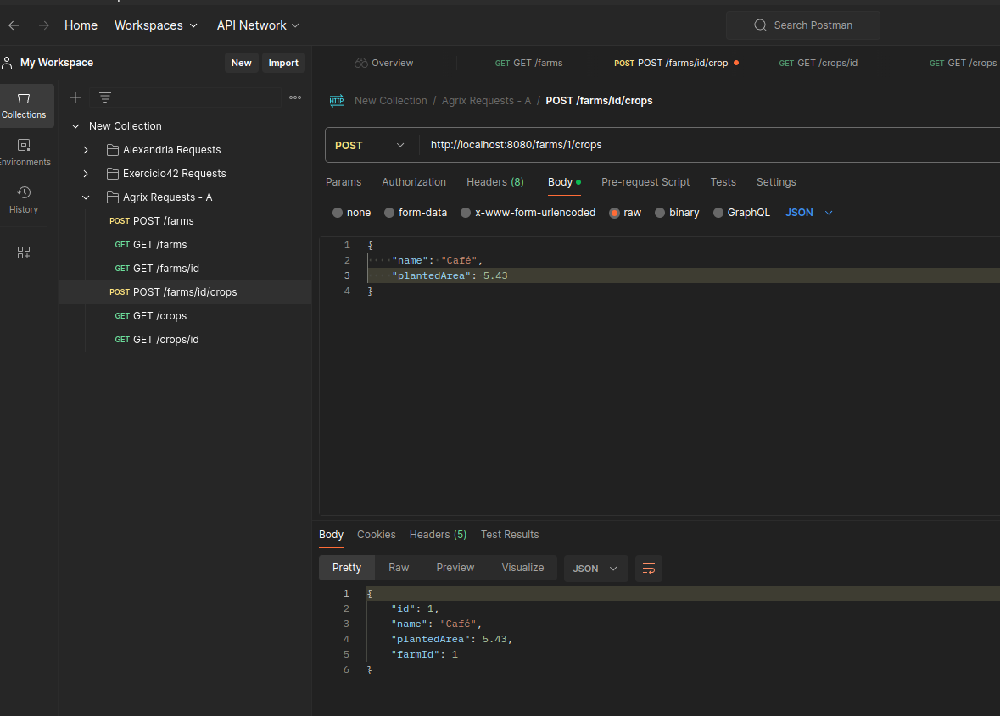
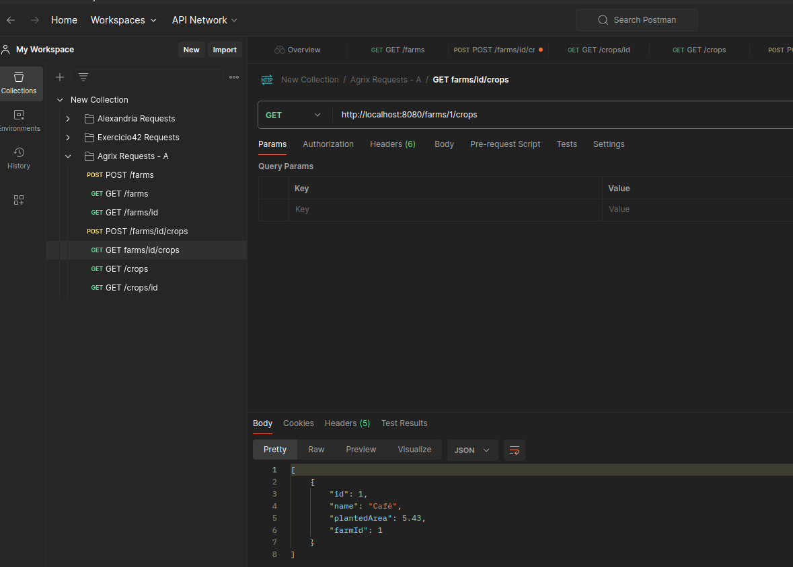
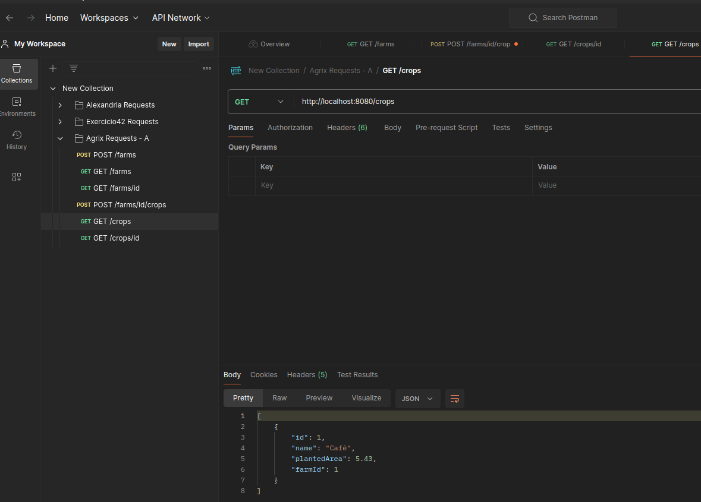
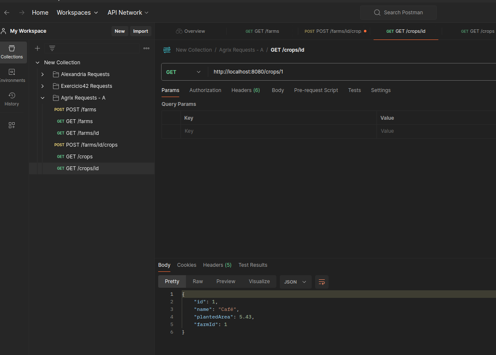

# `Projeto Final - Agrix - Fase A`

Boas-vindas ao repositório do projeto `Projeto Final - Agrix - Fase A`

  
👨‍💻 O que deverá ser desenvolvido
 

Maria e João são pessoas empreendedoras que estão muito preocupadas com os impactos ambientais e
sociais dos nossos processos agrícolas. Por isso, decidiram criar a AgroTech, uma empresa
especializada em tecnologias para melhorar a eficiência no cultivo de plantações. Isso visa reduzir
o desperdício de recursos em geral e de alimentos em específico, fazendo um uso mais responsável da
terra disponível para plantio.

O primeiro produto dessa empresa será o Agrix, um sistema que permitirá a gestão e o monitoramento
das fazendas participantes. Esse produto será desenvolvido em fases.

Neste projeto você deverá desenvolver uma aplicação Spring Boot com algumas funcionalidades
iniciais, e que servirá de base para as próximas fases.

  
<strong>📝 Habilidades  </strong>

- Aplicar o conhecimento do ecossistema Spring para criar rotas da API.
- Aplicar a injeção de dependência para conectar as camadas de controle, serviço e persistência.
- Utilizar o Spring Data JPA para implementar entidades e repositórios para a persistência em banco
  de dados.
- Implementar gerenciamento de erros no Spring Web.
- Criar o Dockerfile para configurar a aplicação para execução no Docker.

## Requisitos

### 1. Crie uma API para controle de fazendas com a rota POST /farms

🔍 Formato/exemplo de resposta 📸
 

 
  

### 2. Crie a rota GET /farms

🔍 Formato/exemplo de resposta 📸
 

 
 

### 3. Crie a rota GET /farms/{id}

🔍 Formato/exemplo de resposta 📸
 

  

### 4. Crie a rota POST /farms/{farmId}/crops

🔍 Formato/exemplo de resposta 📸
 

  
 
    
  

### 5. Crie a rota GET /farms/{farmId}/crops

  
🔍 Formato/exemplo de resposta 📸
 

  
 📸
    
  

### 6. Crie a rota GET /crops

  
🔍 Formato/exemplo de resposta 📸
 

  
 📸
    
  

### 7. Crie a rota GET /crops/{id}

  
🔍 Formato/exemplo de resposta 📸
 
  
 📸
    
  

### 8. Crie um Dockerfile para sua aplicação

